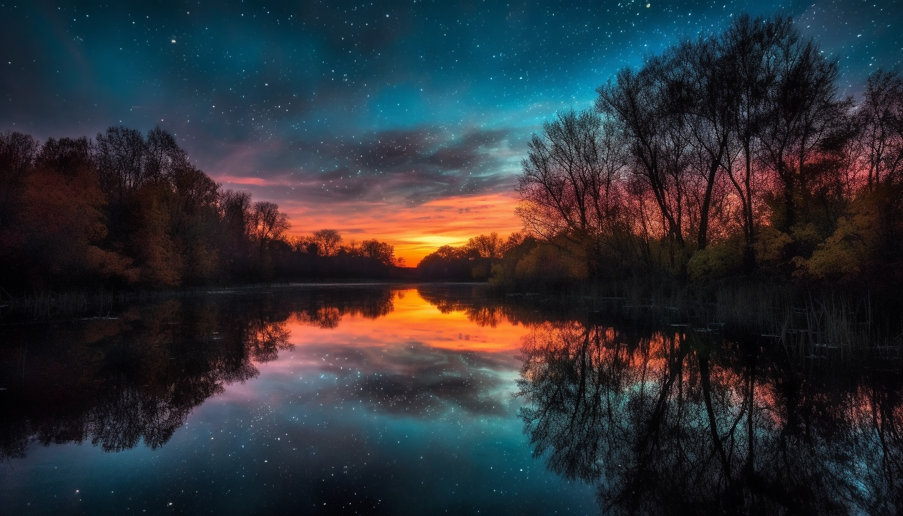

<div align="center">

# 🌍 True Size Atlas & Map Distortion Labs
### *Interactive Mathematical Cartography & Global Representation Explorer*

[](https://map-distortion-explorer.vercel.app)
[](https://vitejs.dev/)
[](https://react.dev/)
[](https://www.typescriptlang.org/)
[](https://d3js.org/)
[](https://vitest.dev/)
[](LICENSE)

<br />

<p align="center">
  
</p>

<p align="center">
  <b>Explore how conformal cylindrical projections (like Mercator) distort our perception of the planet, and compare true spherical landmasses with real-world human, economic, and environmental metrics.</b>
</p>

---

[🚀 **Explore Live App**](https://map-distortion-explorer.vercel.app) • [📖 **Methodology**](docs/methodology.md) • [🏗️ **Architecture**](docs/architecture.md) • [📊 **Data Provenance**](THIRD_PARTY_NOTICES.md)

---

</div>

<br />

## 🌟 What Makes This Innovative?

Most map viewers simply overlay static polygons. **True Size Atlas** combines **real spherical trigonometry**, **3D quaternion kinematics**, **live Web Audio API sound synthesis**, and **D3-powered physics cartograms** into an immersive, game-like experience.

### 🌌 1. Cinematic 3D Intro Portal
- **Hardware-Accelerated 3D Globe**: Real-time D3 orthographic projection rotating the planet with genuine continental geometries, axial tilt, and atmospheric halos.
- **Synthesized Bomb Blast Audio**: Detonation crack transient, sub-bass pitch drop, distortion saturation, and reverberating firestorm rumble built purely with the native browser **Web Audio API** (zero MP3 dependencies, instant playback).
- **Curated Rotating Map Facts**: 200+ geographic trivia entries dynamically refreshed on each session.

### 🔬 2. Dual-Layer Split Comparison (Mercator vs. Equal Earth)
- Drag the interactive split curtain to visually discover why **Greenland appears larger than Africa on Mercator**, even though **Africa is 14× larger** in true surface area ($30.37\text{M km}^2$ vs. $2.16\text{M km}^2$).
- Real-time computation of apparent vs. true area multipliers.

### 🧭 3. Rigid "Move a Country" 3D Physics Lab
- Pick up any country from anywhere on Earth and drag it across latitude bands.
- Uses **unit-quaternion shortest-arc rotation** ($q = \text{shortestArc}(a, b)$, $v' = q v q^{-1}$) to guarantee **zero area deformation** ($\Delta A/A < 0.1\%$) while demonstrating Mercator areal inflation ($\sec^2(\phi)$).

### ⚔️ 4. Same-Scale "Country vs. Country" Arena
- Place any two nations side-by-side on an absolute, unskewed true-area canvas.
- Dynamic true ratio calculation, apparent Mercator ratio comparison, and distortion percentage metrics.

### 🎈 5. "World According To..." Dorling Cartograms
- High-performance collision-resolved physics cartogram where country bubbles scale strictly proportional to **Population**, **GDP**, **Carbon Emissions**, **Forest Area**, and **True Land Surface Area**.
- Real-time zoom-to-country inspection and multi-attribute breakdown.

### 🗺️ 6. Latitude Math Playground & Distortion Choropleth
- Visualizes equal-area Tissot indicatrices across latitude bands from $-80^\circ$ to $+80^\circ$.
- Global distortion leaderboard ranking nations by latitude-induced areal magnification.

---

## 🛠️ Technology Architecture

```
map-distortion-project/
├── apps/
│   ├── web/               # React 19 + TypeScript + Vite + D3.js + Web Audio API
│   └── api/               # FastAPI + Pydantic + Uvicorn analytical backend
├── packages/
│   ├── geo/               # Pure mathematical engine (quaternions, spherical area, Tissot)
│   └── contracts/         # Shared TypeScript data types and schemas
├── data/
│   └── rel-2026-v1/       # Bundled offline TopoJSON / GeoJSON snapshots
├── scripts/               # Budget verifiers and dataset builders
└── vercel.json            # Zero-config cloud deployment settings
```

| Component | Technology | Purpose |
|---|---|---|
| **Web Frontend** | React 19, TypeScript, Vite | Ultra-responsive UI with deep-black obsidian glass theme |
| **Geospatial & Math** | D3 (`d3-geo`, `d3-force`), TopoJSON | 3D orthographic globe, dynamic re-projection, and bubble physics |
| **Audio Engine** | Web Audio API Synthesizer | Zero-latency algorithmic bomb explosions and UI audio |
| **Backend API** | Python 3.13, FastAPI, SQLite | Optional analytical REST endpoints and dataset serving |
| **Testing** | Vitest, Pytest | 100% unit test coverage on numerical and geometrical algorithms |

---

## 🚀 Getting Started Locally

### Prerequisites
- **Node.js** >= 18 (Tested on Node 25)
- **Python** >= 3.11 (Tested on Python 3.13)

### Installation & Run

```bash
# 1. Clone the repository
git clone https://github.com/YOUR_USERNAME/map-distortion-project.git
cd map-distortion-project

# 2. Install Node dependencies
npm install

# 3. Start the Web App
npm run dev
```

Visit **`http://localhost:5173`** in your browser!

### Running Tests

```bash
# Run geometric engine Vitest unit tests
npm test

# Run API integration tests (optional)
PYTHONPATH=. pytest
```

---

## ☁️ Deployment

The project includes pre-configured [`vercel.json`](vercel.json) settings. To deploy your own live copy:

```bash
npx vercel --prod
```

Or connect the repository to **Vercel** / **Netlify** with:
- **Build Command**: `npm run build`
- **Output Directory**: `apps/web/dist`

---

## 📚 Data Provenance & Licenses

- **Geographic Boundaries**: [Natural Earth Admin 0](https://www.naturalearthdata.com/) (Public Domain).
- **Socio-Economic & Environmental Metrics**: [World Bank Development Indicators](https://data.worldbank.org/) (CC BY 4.0).
- **CO2 Emissions Data**: [Global Carbon Project / Our World in Data](https://ourworldindata.org/co2-emissions) (CC BY 4.0).

---

<div align="center">
  <b>Designed with ❤️ for geographic literacy and mathematics exploration.</b>
</div>
